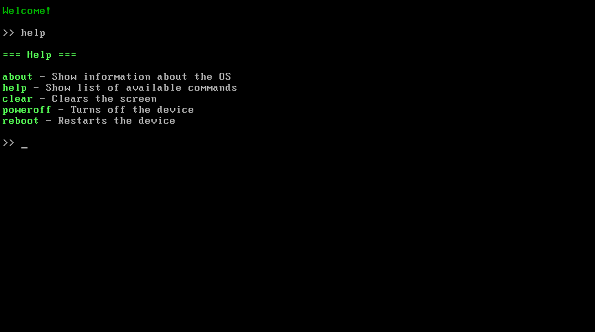

**Page Language: [Русский](README.md) | English**

---

# 🌌 OperatingSystem by TheCreatorOfClearCode

**OperatingSystem by TheCreatorOfClearCode** is a minimalist operating system written in **C**.

---

## 📌 Key Features

- ⚙️ **Modular architecture**
- 🖥️ **Console shell** with support for custom commands

---

**⬇️ [Download](https://github.com/TheCreatorOfClearCode/OperatingSystem/releases/tag/v1.0)**

---

## 📸 Screenshots

> 

---

## 🔧 Building the Project

### Requirements

- **Host:** any Linux distribution
- **Build Packages:**
  - Debian / Ubuntu:
    ```bash
    sudo apt install build-essential gcc-multilib nasm grub-pc-bin xorriso
    ```
  - Arch Linux:
    ```bash
    sudo pacman -S base-devel gcc-multilib nasm grub xorriso
    ```

### Build Instructions

1. Clone the repository:
   ```bash
   git clone https://github.com/TheCreatorOfClearCode/OperatingSystem-by-TheCreatorOfClearCode.git
   cd OperatingSystem-by-TheCreatorOfClearCode
2. Build the project:
    ```bash
    make
    ```
3. A ready-to-run ISO image for the emulator will appear in the directory.

## 📚 Technical Details
- The project uses its own implementation of the C standard library (`string`),
 written entirely from scratch and not based on third-party solutions.
- **GRUB**, which supports the Multiboot specification, is used for booting.
 GRUB loads the ISO image, finds the section with the Multiboot header, and transfers control to its own bootloader, `boot.s`.
